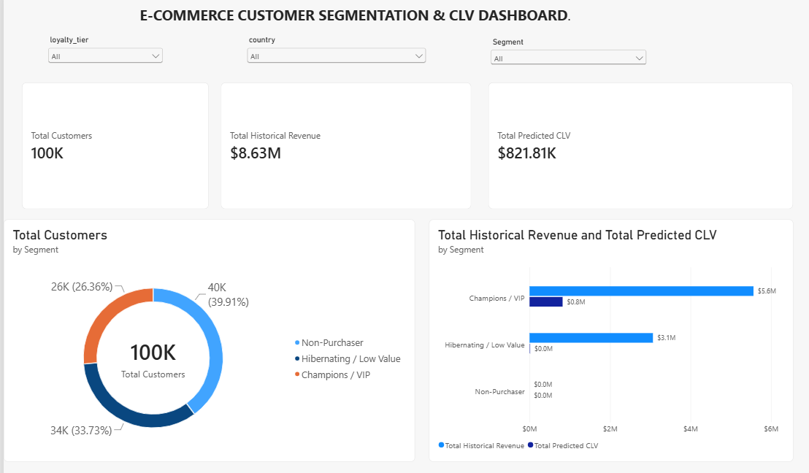

# 🛒 E-Commerce Customer Segmentation & Lifetime Value (CLV) Analytics
This repo contains a Marketing &amp; E-Commerce Analytics project done in Python and PowerBI

[](#)
[](#)
[](#)
[](#)

---

## 📌 Project Overview
This project provides a comprehensive, end-to-end customer analytics solution for an international e-commerce platform with **100,000 customer records**. 

By unifying transaction logs, web activity, and customer profile data, the pipeline performs **RFM Feature Engineering**, **K-Means Clustering**, and **Predictive Modeling (BG/NBD & Gamma-Gamma)** to segment customers and forecast their 12-month Customer Lifetime Value (CLV). The findings are visualized through an interactive **Power BI Dashboard** to drive data-backed retention and marketing allocation strategies.

---

## 📊 Interactive Power BI Dashboard


---

## 💡 Key Business Insights & Strategic Action Plan

Dựa trên dữ liệu phân tích từ mô hình ML và báo cáo Power BI, các chiến lược kinh doanh được đề xuất cụ thể cho từng nhóm khách hàng:

| Customer Segment | Total Customers | Historical Revenue (Avg) | Predicted 12M CLV (Avg) | Key Business Story & Strategic Action Plan |
| :--- | :---: | :---: | :---: | :--- |
| **Champions / VIP** | **26.3%** | **$211.05** | **$31.15** | **High Retention & Loyalty Perks**: Đóng góp hơn 65% tổng doanh thu lịch sử và mang lại giá trị tương lai lớn nhất. <br>👉 *Action*: Triển khai chương trình đặc quyền VIP, dành riêng dịch vụ CSKH ưu tiên và tặng quyền trải nghiệm sớm các sản phẩm mới (Early Access). |
| **Hibernating / Low Value** | **34.1%** | **$90.91** | **$0.02** | **Cost Optimization & Win-back**: Khách hàng cũ có nguy cơ rời bỏ (Churn) cao do khoảng thời gian chưa quay lại mua hàng (`Recency`) quá dài. <br>👉 *Action*: Ngừng chi tiêu quảng cáo bám đuổi đắt đỏ (Retargeting Ads). Chuyển sang kích hoạt lại qua kênh Marketing Automation (Email/Push Notifications) với chi phí tối thiểu. |
| **Non-Purchaser** | **39.6%** | **$0.00** | **$0.00** | **Funnel Activation**: Tập người dùng đã đăng ký tài khoản nhưng bị tắc nghẽn ở bước chuyển đổi đơn hàng đầu tiên (Cart Abandonment). <br>👉 *Action*: Tự động gửi mã giảm giá chào mừng (Welcome Voucher 10–15%) trong 24 giờ sau khi đăng ký để kích hoạt phễu mua hàng. |

---

## 🛠️ Tech Stack & Methodology

### 1. Data Processing & Machine Learning (`Python` on Google Colab)
- **Data Cleaning & Integration**: Merger of transaction records, user profiles, and web activity logs.
- **RFM Feature Engineering**: Extracted Recency, Frequency, and Monetary metrics per customer. Applied Log Transformations to handle skewness.
- **Customer Segmentation**: **K-Means Clustering** optimized via Elbow Method and Silhouette Analysis.
- **Predictive CLV Modeling**:
  - **BG/NBD Model** (Beta-Geometric/Negative Binomial Distribution): Predicted expected transaction counts over the next 12 months.
  - **Gamma-Gamma Model**: Estimated the expected average monetary value per transaction.

### 2. Business Intelligence & Visualization (`Power BI Desktop`)
- **Data Modeling**: Built lightweight `_Measures` table managing custom DAX queries (`Total Customers`, `Total Historical Revenue`, `Total Predicted CLV`).
- **Visual Design**: Executive Z-pattern layout with high-impact KPI Cards, Segment Distribution (Donut Chart), Revenue Comparison (Clustered Bar Chart), and cross-filtering Slicers (`country`, `loyalty_tier`, `Segment`).

---

## 📂 Repository Structure & Data Availability

```text
ecommerce-customer-segmentation-clv/
├── final_customer_analytics_master.csv  # Processed analytics master dataset (Power BI source)
├── customer_segmentation_clv.ipynb      # Complete Python notebook (Data cleaning, ML & CLV modeling)
├── ecommerce_clv_dashboard.pbix         # Interactive Power BI Desktop report
├── dashboard_preview.png                # High-resolution dashboard screenshot
└── README.md                            # Project documentation & Executive summary
